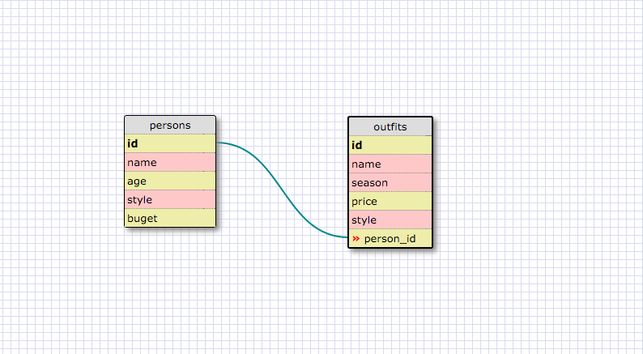

1. SELECT * FROM states;
2. SELECT * FROM regions;
3. SELECT state_name, population FROM states;
4. SELECT state_name, population FROM states ORDER BY population DESC;
5. SELECT state_name FROM states WHERE region_id=7;
6. SELECT state_name, population_density FROM states WHERE population_density > 50 ORDER BY population_density ASC;
7. SELECT state_name FROM states WHERE population BETWEEN 1000000 and 1500000;
8. SELECT state_name, region_id FROM states ORDER BY region_id ASC;
9. SELECT region_name FROM regions WHERE region_name LIKE '%central%';
10. SELECT regions.region_name, states.state_name FROM regions INNER JOIN states ON regions.id=states.region_id;

**What are databases for?**

They allow you to store and easily access information.

**What is a one-to-many relationship?**
It's when two entities are linked, and entity A can be linked to many elements in entity B, but entity B is only linked to one element of entity A.

**What is a primary key? What is a foreign key? How can you determine which is which?**

A primary key is the unique attribute that all entities share.  A foreign key is an attribute on a separate table that links the two tables; it is the primary key on the other table.  We can have multiple foreign keys on a table, but can only have one primary key.

**How can you select information out of a SQL database? What are some general guidelines for that?**

By using SQL queries.  Even though not all DBMS require it, it is good to end each query with a semicolon and to capitalize commands.